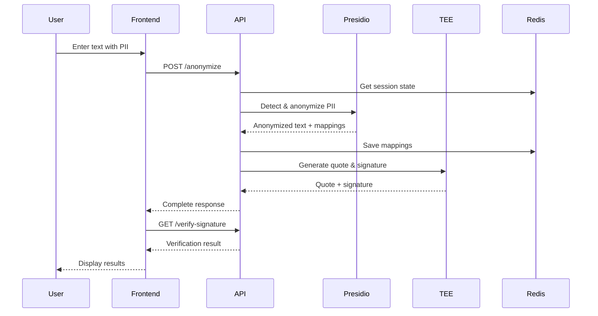

# Architecture Overview

## System Design

PII-TEE is designed as a microservices architecture with clear separation of concerns between the frontend, API, and data layers. The system leverages Trusted Execution Environment (TEE) technology to provide cryptographic proof of secure computation.

## Core Components

### 1. Frontend Application (Next.js)

The frontend provides an intuitive interface for demonstrating PII anonymization:

```typescript
// Key Components
├── app/chat/page.tsx         // Main chat interface
├── components/
│   ├── message-details.tsx   // Expandable message details
│   └── ui/                   // Reusable UI components
├── hooks/
│   ├── useAnonymize.ts      // Anonymization API hook
│   ├── useDeanonymize.ts    // Deanonymization API hook
│   └── useVerify.ts         // Signature verification hook
```

**Features:**
- Three-panel layout (Human View | LLM View | Verification)
- Real-time signature verification
- Expandable details showing full cryptographic proofs
- Session-based state management

### 2. API Service (FastAPI)

The API orchestrates all backend operations:

```python
# Service Layer Architecture
main.py                       # API endpoints
├── services/
│   ├── toolkit_service.py    # Orchestration layer
│   ├── presidio/             # PII detection services
│   │   ├── python_presidio_service.py
│   │   └── instance_counter.py
│   ├── quote/                # TEE attestation
│   │   └── quote_service.py
│   └── state/                # Session management
│       ├── redis_state_service.py
│       └── in_memory_state_service.py
```

### 3. Service Layer Design

#### Toolkit Service (Orchestration)

The `ToolkitService` coordinates between different services:

```python
class ToolkitService:
    def __init__(self, presidio_service, state_service):
        self.presidio_service = presidio_service
        self.state_service = state_service
    
    def anonymize(self, text, session_id, language="en"):
        # 1. Retrieve or create session
        # 2. Anonymize text with Presidio
        # 3. Save entity mappings
        # 4. Generate TEE quote & signature
        # 5. Return complete response
```

#### Presidio Service (PII Detection)

Handles PII detection and anonymization using Microsoft Presidio:

```python
class PythonPresidioService:
    def anonymize_text(self, session_id, text, language, entity_mappings):
        # Detect PII entities
        # Generate consistent replacements
        # Maintain reversible mappings
        return anonymized_text, updated_mappings
    
    def deanonymize_text(self, session_id, text, entity_mappings):
        # Reverse the anonymization
        return original_text
```

**Instance Counter Pattern:**
- Same entities get consistent replacements within a session
- `John Doe` → `<PERSON_0>` (always 0 in the session)
- Enables coherent anonymized conversations

#### Quote Service (TEE Attestation)

Provides cryptographic signatures and TEE attestation:

```python
class QuoteService:
    def __init__(self, signing_method="ecdsa"):
        if signing_method == "ecdsa":
            self._init_ecdsa()  # Ethereum-compatible
        else:
            self._init_ed25519()  # High-performance
    
    def sign_content(self, content):
        # Generate cryptographic signature
        return signature
    
    def verify_signature(self, content, signature, public_key):
        # Verify signature validity
        return is_valid
```

**Signing Methods:**

1. **ECDSA (Default)**
   ```python
   # Ethereum-compatible signatures
   public_key = "0x19EF1DF9d8A3437D771Befa2edA90fc63480a76d"
   signature = "0x1c75ea3eea90ec4f..."
   ```

2. **Ed25519**
   ```python
   # High-performance signatures
   public_key = "base64_encoded_key_here"
   signature = "hex_signature_here"
   ```

#### State Service (Session Management)

Manages session data and entity mappings:

```python
class RedisStateService:
    def set_state(self, session_id, entity_mappings):
        # Store in Redis with TTL
        
    def get_state(self, session_id):
        # Retrieve session data
```

### 4. Data Flow



## API Endpoints

### Core Endpoints

#### POST /anonymize
```json
// Request
{
  "text": "John Doe lives at john@example.com",
  "session_id": "optional-uuid",
  "language": "en"
}

// Response
{
  "session_id": "uuid",
  "text": "<PERSON_0> lives at <EMAIL_ADDRESS_0>",
  "quote": "TEE_ATTESTATION_QUOTE",
  "signature": "0x...",
  "public_key": "0x...",
  "signing_method": "ecdsa"
}
```

#### POST /deanonymize
```json
// Request
{
  "text": "<PERSON_0> lives at <EMAIL_ADDRESS_0>",
  "session_id": "uuid"
}

// Response
{
  "text": "John Doe lives at john@example.com",
  "quote": "TEE_ATTESTATION_QUOTE",
  "signature": "0x...",
  "public_key": "0x...",
  "signing_method": "ecdsa"
}
```

#### GET /verify-signature
```
/verify-signature?content=text&signature=sig&public_key=key&signing_method=ecdsa

// Response
{
  "success": true,
  "data": {
    "is_valid": true,
    "message": "Signature verified successfully"
  }
}
```

## Security Architecture

### TEE Integration

When running in a TEE environment (Intel SGX/TDX):

1. **Attestation**: Proves code is running in secure enclave
2. **Sealing**: Encrypts data that only the enclave can decrypt
3. **Remote Attestation**: Third parties can verify TEE integrity

### Development Mode

In development without TEE hardware:
- Returns mock quotes for testing
- Signatures still work for verification
- Allows full feature testing locally

### Data Privacy

1. **No PII Storage**: Original text never persisted
2. **Session Isolation**: Each session has separate mappings
3. **TTL Expiration**: Redis data expires automatically
4. **Encrypted Transport**: Use HTTPS in production

## Deployment Architecture

### Docker Compose Stack

```yaml
services:
  client-app:
    build: ./src/client_app
    ports: ["3000:3000"]
    environment:
      - NEXT_PUBLIC_API_URL=http://api:80
  
  pii-api:
    build: ./src/api
    ports: ["8080:80"]
    volumes:
      - /var/run/tappd.sock:/var/run/tappd.sock  # TEE socket
    environment:
      - REDIS_HOST=redis
      - SIGNING_METHOD=ecdsa
  
  redis:
    image: redis:7.4-alpine
    command: redis-server --requirepass ${REDIS_PASSWORD}
    volumes:
      - redis_data:/data
```

### Production Considerations

1. **Load Balancing**: Deploy multiple API instances
2. **Redis Cluster**: Use Redis Sentinel for HA
3. **TEE Nodes**: Deploy on TEE-enabled infrastructure
4. **Monitoring**: Implement health checks and metrics
5. **Secrets**: Use secret management (Vault, KMS)

## Performance Characteristics

### Benchmarks

| Operation | Average Time | Throughput |
|-----------|-------------|------------|
| Anonymize (100 chars) | ~50ms | 20 req/s |
| Deanonymize | ~20ms | 50 req/s |
| Signature Generation | ~10ms | 100 req/s |
| Signature Verification | ~5ms | 200 req/s |

### Optimization Strategies

1. **Caching**: Cache verification results
2. **Batch Processing**: Process multiple texts together
3. **Connection Pooling**: Reuse Redis connections
4. **Async Operations**: Use FastAPI's async capabilities

## Extensibility

### Adding New PII Types

1. Create custom Presidio recognizer:
```python
class CustomRecognizer(EntityRecognizer):
    def analyze(self, text, entities, nlp_artifacts):
        # Custom detection logic
        return results
```

2. Register in Presidio service:
```python
analyzer.registry.add_recognizer(CustomRecognizer())
```

### Adding New Signing Methods

1. Implement in QuoteService:
```python
def _init_custom_method(self):
    # Initialize keys
    
def _sign_custom(self, content):
    # Sign content
    
def _verify_custom(self, content, signature, public_key):
    # Verify signature
```

### Integrating with LLMs

The architecture supports LLM integration:
1. Anonymize user input
2. Send to LLM API
3. Receive LLM response
4. Deanonymize for user display

## Monitoring & Observability

### Health Checks

- Frontend: `GET /api/health`
- API: `GET /health` (planned)
- Redis: Built-in ping

### Logging

Comprehensive logging throughout:
```python
logger.info("Anonymizing text for session: %s", session_id)
logger.debug("Entity mappings: %s", mappings)
logger.error("TEE attestation failed: %s", error)
```

### Metrics to Track

1. Request latency by endpoint
2. PII detection accuracy
3. Session count and duration
4. Signature verification success rate
5. TEE attestation availability

## Next Steps

- 📖 [API Reference](./API.md) - Detailed endpoint documentation
- 🧪 [Testing Guide](./TESTING.md) - Testing strategies
- 🚀 [Deployment Guide](./DEPLOYMENT.md) - Production deployment
- 🔒 [Security Guide](./SECURITY.md) - Security best practices